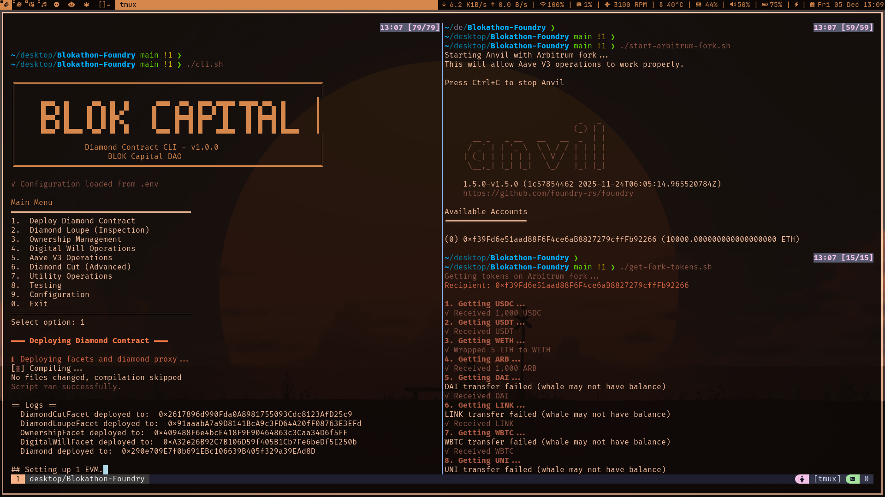
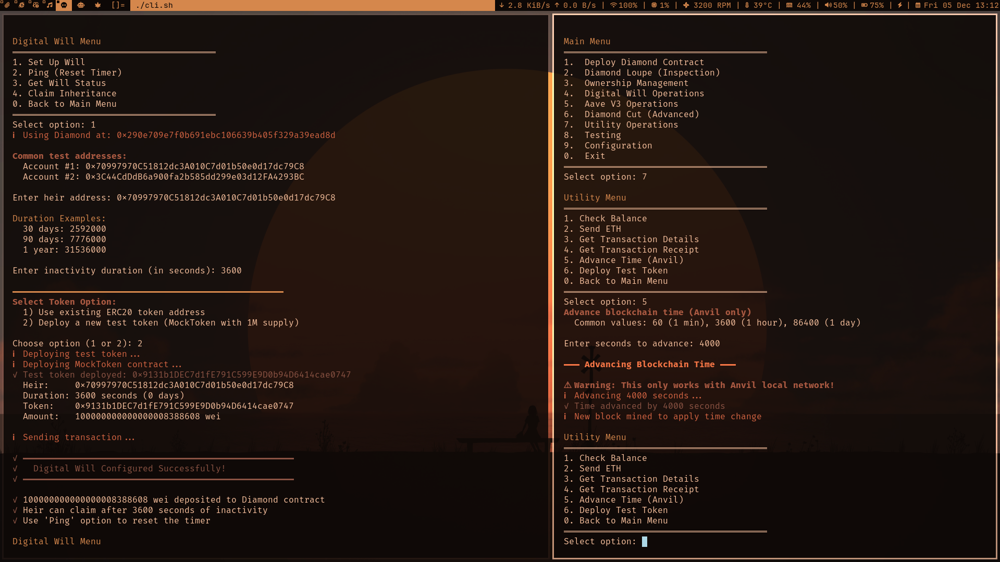
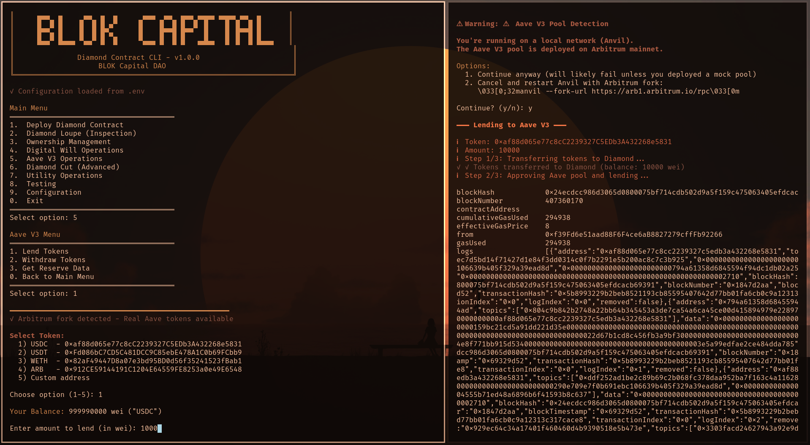

# Digital Will: Modular DeFi Asset Management Platform

## Overview

This repository houses the complete smart contract system for the **Digital Will**, a sophisticated asset management platform engineered using the Diamond Proxy pattern (EIP-2535). It provides a robust, upgradeable foundation built on Foundry, featuring essential components such as a **Diamond Factory** for decentralized vault deployment and advanced tooling for **DeFi Integration**, specifically enabling local testing against an Arbitrum fork with **Aave V3**.

#### Main Menu

#### Will Menu

#### Aave Lending


### Project Mandate

The system is designed to address the need for secure, automated, and upgradeable long-term asset management and inheritance logic within the DeFi ecosystem.

The core utility is provided by the **Digital Will Facet**, which executes complex, multi-step actions upon verifiable, pre-defined triggers (e.g., time-lock expiry, multi-signature confirmation). These actions include:

-   **Estate Liquidity & Distribution**: Automated liquidation or transfer of assets to designated beneficiaries.
-   **Debt Management**: Protocol-level interaction for loan repayment, collateral rebalancing, or health factor maintenance on platforms like Aave.
-   **Security Upgrades**: The modular design allows for continuous incorporation of new security features and protocol versions without migrating user funds.

### Deployment Footprint

| Network | Status | Notes |
| :--- | :--- | :--- |
| **Arbitrum One** (ARB) | Primary Target | Enabled for local fork testing and deployment. |
| **Polygon** (POL) | Supported | Production-ready configuration included. |
| **Avalanche** (AVAX) | Supported | Production-ready configuration included. |
| **Base** | Supported | Production-ready configuration included. |
| **BNB Smart Chain** (BNB) | Supported | Production-ready configuration included. |

---

## I. Technical Architecture

The architecture leverages EIP-2535 to ensure modularity, address the 24KB contract size limit, and provide native upgradeability.

-   **Diamond Factory**: A mechanism for deploying a user's initial Diamond vault (`Diamond.sol`) and its base facets in a single, streamlined transaction, ensuring consistency and gas efficiency.
-   **Aave V3 Integration**: Facilitated by a dedicated facet (e.g., `AaveV3Facet`) that utilizes the locally included Aave V3 Core dependency.

---

## II. Development Environment Setup

### Prerequisites

-   [Foundry](https://book.getfoundry.sh/getting-started/installation) (latest stable version)
-   Git

### Configuration and Installation

1.  **Clone Repository:**
    ```bash
    git clone https://github.com/swarooppatilx/Blokathon-Foundry.git 
    cd Blokathon-Foundry
    ```
2.  **Install Dependencies:**
    ```bash
    forge install
    ```
3.  **Environment Variables:**
    ```bash
    cp .env.example .env
    # Populate .env with RPCs/Keys and source it
    source .env

2.  **Compile & Buid :**
    ```bash
    forge build
    ```

---

## III. Local Testing and Validation

The provided scripts establish a robust development environment for testing DeFi interactions.

| Action | Command | Description |
| :--- | :--- | :--- |
| **Run Fork Environment** | `./start-arbitrum-fork.sh` | Initiates an Anvil instance that forks the Arbitrum mainnet, providing access to real-world DeFi contract environments (e.g., Aave V3). **Must run in a dedicated terminal session.** |
| **Fund Test Wallet** | `./get-fork-tokens.sh` | Executes a series of impersonated transfers from whale addresses on the forked network to fund the default Anvil account with tokens (USDC, WETH, ARB, DAI). |
| **Run All Tests** | `./test-integration.sh` | Executes `forge build`, `forge test`, and validation of deployment scripts and core functionality. |
| **Interface Interaction** | `./cli.sh` | Launches an interactive console for rapid command-line interaction with the deployed Diamond instance. |

---

## IV. Deployment Workflow

### 1. Local Deployment and Factory Initialization

The following commands deploy the core infrastructure onto your local, forked Anvil instance.

```bash
# Deploy the initial Diamond Proxy and its base facets (Cut, Loupe, Ownership, DigitalWill)
forge script script/Deploy.s.sol --rpc-url $RPC_URL_ANVIL --private-key $PRIVATE_KEY_ANVIL --broadcast

# Deploy the centralized Diamond Factory for multi-vault provisioning
forge script script/DeployFactory.s.sol --rpc-url $RPC_URL_ANVIL --private-key $PRIVATE_KEY_ANVIL --broadcast
```
***Action Item:*** *Update `DIAMOND_ADDRESS` and `FACTORY_ADDRESS` in `.env` after successful deployment.*

### 2. Facet Management

Deploy and link new features (facets) to the Diamond proxy using the `DeployFacet.s.sol` script.

```bash
# Example: Deploying and cutting-in the AaveV3Facet
forge script script/DeployFacet.s.sol \
  --rpc-url $RPC_URL_ANVIL \
  --private-key $PRIVATE_KEY_ANVIL \
  --broadcast
```

### 3. Factory Management CLI

The dedicated CLI is the primary interface for managing multi-user deployments through the Diamond Factory.

| Command | Description | Example |
| :--- | :--- | :--- |
| **Provision New Vault** | `./factory-cli.sh deploy [owner_address]` | Deploys a new, isolated Diamond vault for a specified asset owner. |
| **Audit Deployments** | `./factory-cli.sh my-diamonds` | Retrieves a list of all Diamond addresses provisioned by the calling wallet. |
| **Inspect Factory** | `./factory-cli.sh implementations` | Displays the canonical implementation addresses of all facets managed by the Factory. |

---

## V. Repository Structure

```
DigitalWill-Foundry/
├── src/
│   ├── Diamond.sol                # The EIP-2535 Diamond Proxy
│   ├── DiamondFactory.sol         # The Multi-Vault Provisioning Contract
│   └── facets/
│       └── utilityFacets/         # Project-specific logic (DigitalWillFacet, AaveV3Facet, etc.)
├── script/
│   ├── Deploy.s.sol               # Core Diamond deployment logic
│   ├── DeployFactory.s.sol        # Factory deployment logic
│   └── DeployFacet.s.sol          # Individual facet cut/upgrade logic
├── test/                          # Comprehensive Foundry Test Suite
├── factory-cli.sh                 # Diamond Factory CLI
├── start-arbitrum-fork.sh         # Arbitrum Fork setup script
└── get-fork-tokens.sh             # Test asset funding script
```